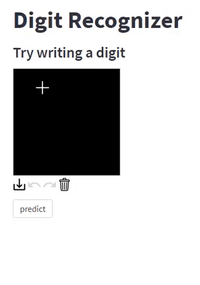

# Hand-written-digits-Recognizer

Streamlit app for recognizing hand written digits using Convoultional Neural Network

[](https://share.streamlit.io/999harish999/hand-written-digits-recognizer/main/streamlit_host.py)


## Project Overview

This is a simple Digit Recognizer app which recognizes the handwritten digits. The user can give input by drawing the digits on the canvas and get predictions.

## Deployment : 
The App is built using streamlit and deployed on https://share.streamlit.io/

## Model :
Convolutional Neural Network Model trained using keras API

## Data : 
Handwritten images for training the model was taken from MNIST ("Modified National Institute of Standards and Technology") dataset through kaggle    (https://www.kaggle.com/c/digit-recognizer/data). Dataset includes 40,000 images of handwritten digits 0 to 9 with uniform class distribution.


## Approach : 
Two types of nerural netowrk architechure were used for analysis, Artifical Neural network(ANN) and Convolutional Neural Networks(CNN). 90% of images were used for training and 10% for testing. Both type of models were tunned and best hyperparameters were selected using keras_tunner. Final Validation accuracies for both the models were compared after 20 EPOCHS and was concluded that CNN was performing better. CNN val score =99.991% , ANN val score =98.91%. Final CNN model was trained on entire dataset for 20 EPOCHS. A streamlist app was built around this model and deployed on https://share.streamlit.io/

Approach and Model buling Document is available in [Digit_Recognizer_kaggle.ipynb ipython notebook](Digit_Recognizer_kaggle.ipynb)


## Demo
[](https://share.streamlit.io/999harish999/hand-written-digits-recognizer/main/streamlit_host.py)



## Compute Configuration 
App was developed and deployed using bellow configuration 

```http
python 3.7.11
tensorflow 2.0.0
tensorflow-estimater 2.0.0
h5py 2.1.0
streamlit 0.89.0
```


